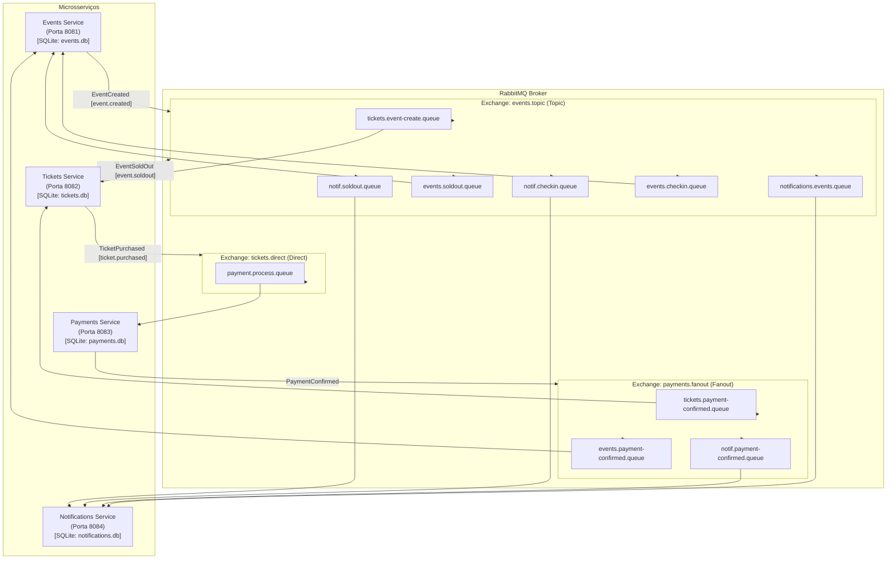
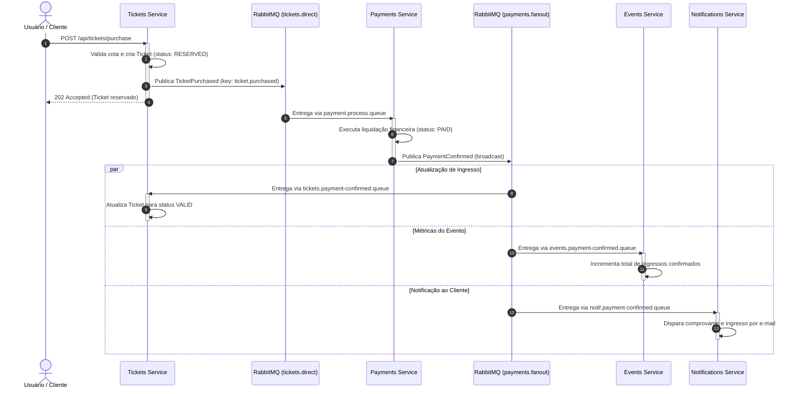
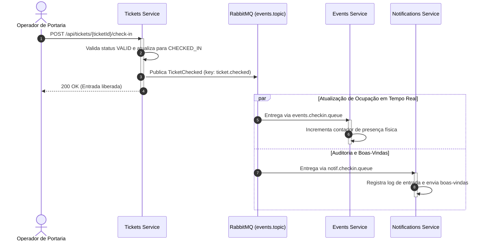

# Documentação Arquitetural do Sistema de Vendas e Gestão de Eventos

## 1. Introdução

### 1.1. Descrição do Problema

Plataformas convencionais de emissão e comercialização de ingressos sofrem com regimes de carga acentuadamente assimétricos. Enquanto a maior parte do ciclo de vida de um evento opera sob demanda estável, momentos de abertura de lotes promocionais (*flash sales*) concentram centenas ou milhares de requisições por segundo. Em sistemas baseados exclusivamente em comunicação síncrona HTTP/REST entre serviços, essa sobrecarga expõe fragilidades estruturais:

* **Esgotamento de Pools de Conexão:** Falhas encadeadas (*cascading failures*) provocadas pela lentidão acumulada de ponta a ponta (ex.: latência em gateways de pagamento ou servidores de correio eletrônico retendo conexões HTTP).
* **Acoplamento Temporal Rígido:** A indisponibilidade transiente de um serviço secundário (como o envio de notificações) impede a conclusão de operações de negócio primárias (a reserva e o pagamento do ingresso).
* **Condições de Corrida e Inconsistências:** Dificuldade em garantir o isolamento estrito de inventário e evitar venda além da capacidade máxima (*overselling*) sem introduzir gargalos de lock distribuído.

### 1.2. Objetivos do Sistema

Projetar e entregar um ecossistema distribuído de alta disponibilidade e tolerância a falhas para gestão de eventos, reserva e emissão de ingressos, liquidação financeira com garantia de idempotência, auditoria de portaria (check-in) e comunicação com clientes, garantindo:

* Isolamento de domínio e dados entre os serviços.
* Processamento assíncrono não bloqueante para operações críticas.
* Rastreabilidade e consistência eventual garantida por eventos de domínio.

### 1.3. Motivação para usar EDA (Event-Driven Architecture)

* **Desacoplamento Espaço-Temporal:** Produtores emitem eventos sem conhecimento prévio da disponibilidade ou da localização física dos consumidores. O `tickets` não precisa aguardar o término do processamento do `payments` ou a confirmação de envio do `notifications`.
* **Nivelamento de Carga (*Load Leveling / Buffering*):** O Message Broker atua como amortecedor elástico, enfileirando picos de tráfego de checkout para que os consumidores processem as mensagens em seu limite ótimo operacional, protegendo a camada de banco de dados.
* **Extensibilidade e Evolução Independente:** Novos nós de negócio (ex.: sistemas de controle de acesso físico, auditoria fiscal, algoritmos de recomendação) podem ser integrados ao ecossistema simplesmente criando novas filas ligadas às exchanges existentes, sem alteração de uma única linha de código nos serviços produtores.

---

## 2. Arquitetura

### 2.1. Diagrama de Componentes e Topologia RabbitMQ

O sistema aplica os princípios de **Event-Driven Architecture (EDA)** combinados ao padrão **Database-per-Service**, onde cada microsserviço mantém seu próprio banco de dados relacional isolado (SQLite) e orquestra seus processos por meio do **RabbitMQ**.



### 2.2. Descrição dos Serviços

#### 1. Events Service (`events-service`)

* **Porta:** `8081`
* **Banco de Dados:** SQLite (`events.db`)
* **Responsabilidades:**
* Manter o catálogo oficial de eventos (`id`, `name`, `description`, `eventDate`, `maxCapacity`, `basePrice`).
* Gerenciar o ciclo de vida do evento através de seus estados de disponibilidade (`ATIVO`, `ESGOTADO`, `CANCELADO`).
* Consolidar contadores de ocupação física e ingressos liquidados.


* **Mensageria:**
* *Produtor:* `EventCreatedEvent` na exchange `events.topic` com chave `event.created`.
* *Consumidor:* `EventSoldOutEvent`, `PaymentConfirmedEvent`, `TicketCheckedEvent`.


#### 2. Tickets Service (`tickets-service`)

* **Porta:** `8082`
* **Banco de Dados:** SQLite (`tickets.db`)
* **Responsabilidades:**
* Manter inventário local isolado de cotas de ingressos por evento (`TicketInventory`).
* Processar solicitações de reserva e emitir bilhetes em estado temporário (`RESERVED` / `PENDING`).
* Detectar saturação de capacidade e emitir alerta de esgotamento.
* Efetuar a validação do ingresso na portaria (check-in), promovendo-o a `CHECKED_IN`.


* **Mensageria:**
* *Produtor:* `TicketPurchasedEvent` na exchange `tickets.direct` (`ticket.purchased`); `EventSoldOutEvent` e `TicketCheckedEvent` na exchange `events.topic`.
* *Consumidor:* `EventCreatedEvent` (inicialização de inventário) e `PaymentConfirmedEvent` (ativação do ingresso para `VALID`).


#### 3. Payments Service (`payments-service`)

* **Porta:** `8083`
* **Banco de Dados:** SQLite (`payments.db`)
* **Responsabilidades:**
* Receber intenções de compra geradas pelo domínio de ingressos.
* Executar a liquidação da cobrança simulada.
* Garantir processamento estritamente idempotente por transação (`ticketId`) e mensagem (`messageId`).


* **Mensageria:**
* *Consumidor:* `TicketPurchasedEvent` (via fila `payment.process.queue` na exchange `tickets.direct`).
* *Produtor:* `PaymentConfirmedEvent` na exchange `payments.fanout`.


#### 4. Notifications Service (`notifications-service`)

* **Porta:** `8084`
* **Banco de Dados:** SQLite (`notifications.db`)
* **Responsabilidades:**
* Atuar como serviço terminal multicanal, disparando alertas e recibos operacionais (E-mail, Push).
* Manter histórico de auditoria das mensagens e eventos de comunicação disparados aos usuários e organizadores.


* **Mensageria:**
* *Consumidor:* `EventCreatedEvent`, `PaymentConfirmedEvent`, `EventSoldOutEvent`, `TicketCheckedEvent`.
* *Produtor:* Nenhum (nó consumidor terminal).


---

### 2.3. Fluxo Detalhado de Eventos

#### Cenário A: Criação de Evento

O organizador cadastra um novo evento. O catálogo é criado, o inventário de ingressos é inicializado de forma assíncrona e a divulgação inicial é preparada.


#### Cenário B: Compra e Confirmação de Pagamento

O usuário solicita a reserva do ingresso. O pagamento é liquidado pelo gateway dedicado e a confirmação financeira é difundida em broadcast para atualizar o ingresso, decrementar a vaga e emitir o recibo.



#### Cenário C: Evento Esgotado (*Sold Out*)

Ao confirmar ou reservar a totalidade dos bilhetes disponíveis, o serviço de ingressos publica o fato de lotação máxima para alteração de catálogo e disparo de alertas.


#### Cenário D: Validação na Portaria (Check-in)

Na entrada do evento, o bilhete é conferido. Sua utilização física atualiza a presença no evento e audita a entrada.



---

## 3. Decisões Técnicas

### 3.1. Justificativa para Escolha do Broker: RabbitMQ

A escolha do RabbitMQ como mecanismo central de mensageria fundamenta-se nos seguintes critérios:

* **Suporte Nativo a Padrões de Roteamento Ricos:** Implementa integralmente o protocolo AMQP 0-9-1, oferecendo separação explícita entre pontos de troca (*exchanges*) e estruturas de armazenamento (*queues*). Isso permite orquestrar simultaneamente comunicações ponto a ponto, publicações filtradas e difusões globais.
* **Garantias Estritas de Entrega e Persistência:** Capacidade de persistir mensagens em disco (`deliveryMode = PERSISTENT`) e exigir confirmações explícitas de processamento (*consumer acks*). Em caso de encerramento anômalo de um consumidor, a mensagem retorna à fila sem perda de dados de negócio.
* **Operação Simplificada em Ambientes em Nuvem/Containers:** Menor complexidade operacional e consumo de recursos reduzido em comparação com plataformas de log distribuído (ex.: Apache Kafka), que exigem particionamento antecipado e governança de offsets para fluxos transacionais discretos.

---

### 3.2. Tipos de Exchange e Justificativas

| Exchange | Tipo AMQP | Justificativa Arquitetural |
| --- | --- | --- |
| **`tickets.direct`** | **Direct** | **Encaminhamento ponto a ponto determinístico.** A intenção de compra (`ticket.purchased`) representa uma ordem estritamente transacional voltada à liquidação financeira. A exchange direct direciona a mensagem exclusivamente para a fila privada do `payments-service` (`payment.process.queue`), impedindo o recebimento prematuro por outros módulos. |
| **`payments.fanout`** | **Fanout** | **Difusão 1-para-N (Broadcast de Fato Consolidado).** Quando um pagamento é aprovado, esse evento de domínio afeta múltiplos limites de contexto: emissão do ingresso (`tickets`), contabilidade de vagas (`events`) e envio de comprovante (`notifications`). A exchange fanout entrega cópias idênticas e simultâneas para todas as filas vinculadas, com desempenho máximo e sem custo de processamento de regras de roteamento. |
| **`events.topic`** | **Topic** | **Roteamento flexível baseado em padrões.** Trata eventos do ciclo de vida que possuem diferentes graus de interesse (`event.created`, `event.soldout`, `ticket.checked`). Permite vincular filas usando casamento de padrões com granularidade por domínio sem necessidade de criar dezenas de exchanges específicas. |

---

### 3.3. Padrões de Mensageria e Concorrência Aplicados

* **Idempotent Consumer (Consumidor Idempotente):** No `payments-service`, o processamento de pagamentos valida restrições únicas no SQLite (`ticket_id` e `message_id`). Mensagens reenviadas pelo broker em decorrência de timeouts de rede são detectadas antes da escrita, registrando aviso de duplicidade e abortando novo faturamento.
* **Database per Service:** O isolamento estrutural dos esquemas SQLite garante que nenhum microsserviço acesse tabelas alheias. Toda sincronização de estado ocorre por meio do tráfego assíncrono de eventos de integração.
* **Concorrência Otimizada no SQLite:** Para contornar a limitação de concorrência mono-escritor do SQLite, todos os microsserviços foram configurados com modo **WAL (Write-Ahead Logging)** e **busy_timeout** de 5000 milissegundos via JDBC (`journal_mode=WAL&busy_timeout=5000`). Isso viabiliza leituras simultâneas a operações de escrita e introduz tempo de espera automático contra exceções `SQLITE_BUSY`.
* **Cross-Service Class Mapping:** Como cada microsserviço compila em pacotes Java isolados, o `JacksonJsonMessageConverter` do Spring AMQP foi customizado com `DefaultClassMapper` e `idClassMapping` explícito. Esse desacoplamento traduz os nomes de classes declarados no cabeçalho `__TypeId__` para os DTOs do contexto receptor sem disparar erros de `ClassNotFoundException`.

---

## 4. Eventos do Sistema

### 4.1. Matriz de Eventos e Roteamento AMQP

| Evento | Exchange | Tipo | Routing Key | Produtor | Filas Vinculadas | Consumidores |
| :--- | :--- | :--- | :--- | :--- | :--- | :--- |
| `EVENT_CREATED` | `events.topic` | Topic | `event.created` | `events-service` | `tickets.event-create.queue`<br>`notifications.events.queue` | `tickets-service`<br>`notifications-service` |
| `TICKET_PURCHASED` | `tickets.direct` | Direct | `ticket.purchased` | `tickets-service` | `payment.process.queue` | `payments-service` |
| `PAYMENT_CONFIRMED` | `payments.fanout` | Fanout | `""` *(broadcast)* | `payments-service` | `tickets.payment-confirmed.queue`<br>`events.payment-confirmed.queue`<br>`notif.payment-confirmed.queue` | `tickets-service`<br>`events-service`<br>`notifications-service` |
| `EVENT_SOLDOUT` | `events.topic` | Topic | `event.soldout` | `tickets-service` | `events.soldout.queue`<br>`notif.soldout.queue` | `events-service`<br>`notifications-service` |
| `TICKET_CHECKED` | `events.topic` | Topic | `ticket.checked` | `tickets-service` | `events.checkin.queue`<br>`notif.checkin.queue` | `events-service`<br>`notifications-service` |

---

### 4.2. Especificação Completa dos Payloads (JSON)

#### 1. `EVENT_CREATED`

Publicado pelo `events-service` para notificar a disponibilização de um novo evento no sistema.

* **Exchange:** `events.topic`
* **Routing Key:** `event.created`

```json
{
  "eventId": 1,
  "name": "DevOps & Cloud Summit 2026",
  "maxCapacity": 100,
  "basePrice": 200.00,
  "eventDate": "2026-11-15T19:00:00",
  "eventType": "EVENT_CREATED",
  "messageId": "9b1deb4d-3b7d-4bad-9bdd-2b0d7b3dcb6d",
  "timestamp": "2026-09-30T10:00:00"
}

```

* **Campos:**
* `eventId` (`Long`): Identificador único do evento criado.
* `name` (`String`): Nome descritivo do evento.
* `maxCapacity` (`Integer`): Capacidade máxima total de público permitida.
* `basePrice` (`BigDecimal`): Preço unitário base para os ingressos.
* `eventDate` (`LocalDateTime`): Data e horário agendados para realização do evento.
* `eventType` (`String`): Tipo de evento de mensageria (`EVENT_CREATED`).
* `messageId` (`String`): Identificador universal único (UUID) para rastreabilidade.
* `timestamp` (`LocalDateTime`): Instante de emissão da mensagem no broker.


---

#### 2. `TICKET_PURCHASED`

Publicado pelo `tickets-service` ao receber uma solicitação de reserva e emitir um ticket provisório.

* **Exchange:** `tickets.direct`
* **Routing Key:** `ticket.purchased`

```json
{
  "ticketId": 1,
  "eventId": 1,
  "customerName": "Amanda Ribeiro",
  "customerEmail": "amanda@email.com",
  "amount": 200.00,
  "eventType": "TICKET_PURCHASED",
  "messageId": "701afcca-75e2-41b0-8af8-57ce09f92207",
  "timestamp": "2026-09-30T10:05:00"
}

```

* **Campos:**
* `ticketId` (`Long`): Identificador único do ingresso reservado.
* `eventId` (`Long`): Identificador do evento ao qual o ingresso pertence.
* `customerName` (`String`): Nome do comprador.
* `customerEmail` (`String`): E-mail do titular da compra para faturamento e envio.
* `amount` (`BigDecimal`): Valor total a ser cobrado pelo bilhete.
* `eventType` (`String`): Identificador do evento (`TICKET_PURCHASED`).
* `messageId` (`String`): UUID exclusivo da transação de reserva.
* `timestamp` (`LocalDateTime`): Instante de criação do evento.


---

#### 3. `PAYMENT_CONFIRMED`

Publicado pelo `payments-service` após confirmação e liquidação bem-sucedida da cobrança.

* **Exchange:** `payments.fanout`
* **Routing Key:** *(vazia - broadcast)*

```json
{
  "paymentId": 1,
  "ticketId": 1,
  "eventId": 1,
  "customerEmail": "amanda@email.com",
  "amount": 200.00,
  "status": "PAID",
  "eventType": "PAYMENT_CONFIRMED",
  "messageId": "f47ac10b-58cc-4372-a567-0e02b2c3d479",
  "timestamp": "2026-09-30T10:05:02"
}

```

* **Campos:**
* `paymentId` (`Long`): Identificador único gerado para a liquidação no banco de pagamentos.
* `ticketId` (`Long`): Identificador do ingresso liberado.
* `eventId` (`Long`): Identificador do evento associado.
* `customerEmail` (`String`): E-mail do cliente para emissão de recibo pelo notification-service.
* `amount` (`BigDecimal`): Valor financeiro liquidado.
* `status` (`String`): Estado final da transação financeira (`PAID`).
* `eventType` (`String`): Identificador do evento (`PAYMENT_CONFIRMED`).
* `messageId` (`String`): UUID da mensagem de confirmação.
* `timestamp` (`LocalDateTime`): Instante de conclusão do pagamento.


---

#### 4. `EVENT_SOLDOUT`

Emitido pelo `tickets-service` no momento em que a soma de ingressos confirmados e reservados consome 100% da cota do inventário.

* **Exchange:** `events.topic`
* **Routing Key:** `event.soldout`

```json
{
  "eventId": 1,
  "name": "DevOps & Cloud Summit 2026",
  "totalCapacity": 100,
  "eventType": "EVENT_SOLDOUT",
  "messageId": "c9a646d3-9c61-4cd7-9f5b-7a637a8b321a",
  "timestamp": "2026-09-30T10:10:00"
}

```

* **Campos:**
* `eventId` (`Long`): Identificador do evento esgotado.
* `name` (`String`): Nome do evento para contextualização de alertas.
* `totalCapacity` (`Integer`): Lotação máxima atingida.
* `eventType` (`String`): Identificador do evento (`EVENT_SOLDOUT`).
* `messageId` (`String`): UUID exclusivo da ocorrência.
* `timestamp` (`LocalDateTime`): Instante em que o limite foi alcançado.


---

#### 5. `TICKET_CHECKED`

Emitido pelo `tickets-service` ao efetivar o acesso físico do participante na portaria.

* **Exchange:** `events.topic`
* **Routing Key:** `ticket.checked`

```json
{
  "ticketId": 1,
  "eventId": 1,
  "customerEmail": "amanda@email.com",
  "gateNumber": "Portão A",
  "checkedAt": "2026-11-15T18:45:00",
  "eventType": "TICKET_CHECKED",
  "messageId": "a1b2c3d4-e5f6-7a8b-9c0d-1e2f3a4b5c6d",
  "timestamp": "2026-11-15T18:45:00"
}

```

* **Campos:**
* `ticketId` (`Long`): Identificador do ingresso validado.
* `eventId` (`Long`): Identificador do evento de acesso.
* `customerEmail` (`String`): E-mail do portador para fins de auditoria e boas-vindas.
* `gateNumber` (`String`): Identificação da catraca ou portão de entrada.
* `checkedAt` (`LocalDateTime`): Registro temporal da entrada validada.
* `eventType` (`String`): Identificador do evento (`TICKET_CHECKED`).
* `messageId` (`String`): UUID da mensagem de check-in.
* `timestamp` (`LocalDateTime`): Instante do registro no sistema.


---

## 5. Endpoints (API REST)

### 5.1. Events Service (`http://localhost:8081`)

#### Criar Evento

* **Método:** `POST`
* **Rota:** `/api/events`
* **Headers:** `Content-Type: application/json`
* **Request Body:**
```json
{
  "name": "DevOps & Cloud Summit 2026",
  "description": "Encontro sobre microsserviços e mensageria",
  "eventDate": "2026-11-15T19:00:00",
  "maxCapacity": 2,
  "basePrice": 200.00
}

```


* **Status de Sucesso:** `201 Created`
* **Response Body:**
```json
{
  "id": 1,
  "name": "DevOps & Cloud Summit 2026",
  "description": "Encontro sobre microsserviços e mensageria",
  "eventDate": "2026-11-15T19:00:00",
  "maxCapacity": 2,
  "basePrice": 200.00,
  "confirmedTickets": 0,
  "checkedInTickets": 0,
  "status": "ATIVO",
  "createdAt": "2026-09-30T10:00:00",
  "updatedAt": "2026-09-30T10:00:00"
}

```


#### Listar Todos os Eventos

* **Método:** `GET`
* **Rota:** `/api/events`
* **Status de Sucesso:** `200 OK`
* **Response Body:** Array JSON contendo a lista completa de eventos.

#### Consultar Evento por ID

* **Método:** `GET`
* **Rota:** `/api/events/{id}`
* **Status:** `200 OK` (se localizado) ou `404 Not Found`.

---

### 5.2. Tickets Service (`http://localhost:8082`)

#### Comprar / Reservar Ingresso

* **Método:** `POST`
* **Rota:** `/api/tickets/purchase`
* **Headers:** `Content-Type: application/json`
* **Request Body:**
```json
{
  "eventId": 1,
  "customerName": "Amanda Ribeiro",
  "customerEmail": "amanda@email.com"
}

```


* **Status de Sucesso:** `202 Accepted`
* **Response Body:**
```json
{
  "id": 1,
  "eventId": 1,
  "customerName": "Amanda Ribeiro",
  "customerEmail": "amanda@email.com",
  "price": 200.00,
  "status": "PENDING",
  "createdAt": "2026-09-30T10:05:00",
  "updatedAt": "2026-09-30T10:05:00"
}

```


#### Realizar Check-in de Ingresso

* **Método:** `POST`
* **Rota:** `/api/tickets/{ticketId}/check-in`
* **Status de Sucesso:** `200 OK`
* **Response Body:**
```json
{
  "id": 1,
  "eventId": 1,
  "customerName": "Amanda Ribeiro",
  "customerEmail": "amanda@email.com",
  "price": 200.00,
  "status": "CHECKED_IN",
  "createdAt": "2026-09-30T10:05:00",
  "updatedAt": "2026-09-30T10:15:00"
}

```


#### Consultar Ingresso por ID

* **Método:** `GET`
* **Rota:** `/api/tickets/{ticketId}`
* **Status:** `200 OK` ou `404 Not Found`.

#### Consultar Inventário Local do Evento

* **Método:** `GET`
* **Rota:** `/api/tickets/inventory/{eventId}`
* **Status de Sucesso:** `200 OK`
* **Response Body:**
```json
{
  "id": 1,
  "eventId": 1,
  "eventName": "DevOps & Cloud Summit 2026",
  "totalCapacity": 2,
  "reservedTickets": 1,
  "confirmedTickets": 1,
  "checkedInTickets": 0,
  "basePrice": 200.00,
  "createdAt": "2026-09-30T10:00:00",
  "updatedAt": "2026-09-30T10:05:00"
}

```


---

## 6. Configuração e Infraestrutura

### 6.1. Configuração do Docker Compose (`docker-compose.yml`)

A orquestração do ecossistema consolida o broker RabbitMQ e os quatro microsserviços. Os serviços dependem de um *healthcheck* nativo do RabbitMQ para iniciar somente quando o broker estiver pronto para aceitar conexões.

```yaml
version: '3.8'

services:
  rabbitmq:
    image: rabbitmq:3-management-alpine
    container_name: rabbitmq
    ports:
      - "5672:5672"
      - "15672:15672"
    environment:
      RABBITMQ_DEFAULT_USER: admin
      RABBITMQ_DEFAULT_PASS: admin
    volumes:
      - rabbitmq_data:/var/lib/rabbitmq
    healthcheck:
      test: ["CMD", "rabbitmqctl", "status"]
      interval: 10s
      timeout: 5s
      retries: 5

  events-service:
    build:
      context: ./services/events
      dockerfile: Dockerfile
    container_name: events-service
    ports:
      - "8081:8081"
    environment:
      RABBITMQ_HOST: rabbitmq
      RABBITMQ_PORT: 5672
      RABBITMQ_USERNAME: admin
      RABBITMQ_PASSWORD: admin
    volumes:
      - ./services/events/data:/app/data
    depends_on:
      rabbitmq:
        condition: service_healthy

  tickets-service:
    build:
      context: ./services/tickets
      dockerfile: Dockerfile
    container_name: tickets-service
    ports:
      - "8082:8082"
    environment:
      RABBITMQ_HOST: rabbitmq
      RABBITMQ_PORT: 5672
      RABBITMQ_USERNAME: admin
      RABBITMQ_PASSWORD: admin
    volumes:
      - ./services/tickets/data:/app/data
    depends_on:
      rabbitmq:
        condition: service_healthy

  payments-service:
    build:
      context: ./services/payments
      dockerfile: Dockerfile
    container_name: payments-service
    ports:
      - "8083:8083"
    environment:
      RABBITMQ_HOST: rabbitmq
      RABBITMQ_PORT: 5672
      RABBITMQ_USERNAME: admin
      RABBITMQ_PASSWORD: admin
    volumes:
      - ./services/payments/data:/app/data
    depends_on:
      rabbitmq:
        condition: service_healthy

  notifications-service:
    build:
      context: ./services/notifications
      dockerfile: Dockerfile
    container_name: notifications-service
    ports:
      - "8084:8084"
    environment:
      RABBITMQ_HOST: rabbitmq
      RABBITMQ_PORT: 5672
      RABBITMQ_USERNAME: admin
      RABBITMQ_PASSWORD: admin
    volumes:
      - ./services/notifications/data:/app/data
    depends_on:
      rabbitmq:
        condition: service_healthy

volumes:
  rabbitmq_data:

```

---

### 6.2. Estratégia de Build Multi-stage (`Dockerfile`)

Cada microsserviço adota a estratégia de compilação em múltiplos estágios (*multi-stage build*), isolando o SDK de desenvolvimento do ambiente de produção e gerando contêineres mínimos baseados em Alpine Linux JRE 21:

```dockerfile
# Estágio 1: Compilação e Empacotamento
FROM eclipse-temurin:21-jdk-alpine AS builder
WORKDIR /app

# Cache de dependências Maven
COPY pom.xml .
COPY .mvn .mvn
COPY mvnw .
RUN ./mvnw dependency:go-offline -B

# Compilação dos fontes da aplicação
COPY src src
RUN ./mvnw clean package -DskipTests

# Estágio 2: Imagem Final de Execução
FROM eclipse-temurin:21-jre-alpine
WORKDIR /app

# Diretório para persistência do SQLite
RUN mkdir -p /app/data

# Copia apenas o artefato executável final
COPY --from=builder /app/target/*.jar app.jar

ENTRYPOINT ["java", "-jar", "app.jar"]

```

---

### 6.3. Configuração dos Serviços (`application.properties`)

Cada serviço utiliza propriedades com valores padrão (*fallback*) para viabilizar execução tanto em contêineres Docker quanto em desenvolvimento local:

```properties
# Exemplo aplicado ao events-service
server.port=8081
spring.application.name=events

# Conexão RabbitMQ parametrizada via variáveis de ambiente
spring.rabbitmq.host=${RABBITMQ_HOST:localhost}
spring.rabbitmq.port=${RABBITMQ_PORT:5672}
spring.rabbitmq.username=${RABBITMQ_USERNAME:admin}
spring.rabbitmq.password=${RABBITMQ_PASSWORD:admin}

# Persistência SQLite com WAL Mode e Busy Timeout para concorrência
spring.datasource.url=jdbc:sqlite:./data/events.db?journal_mode=WAL&busy_timeout=5000
spring.datasource.driver-class-name=org.sqlite.JDBC
spring.jpa.database-platform=org.hibernate.community.dialect.SQLiteDialect
spring.jpa.hibernate.ddl-auto=update

# Limitação do Pool Hikari para evitar disputa mono-escritor no arquivo
spring.datasource.hikari.maximum-pool-size=1

```