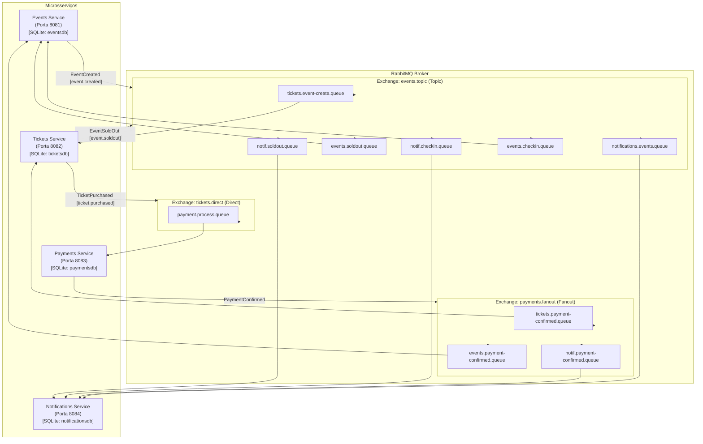
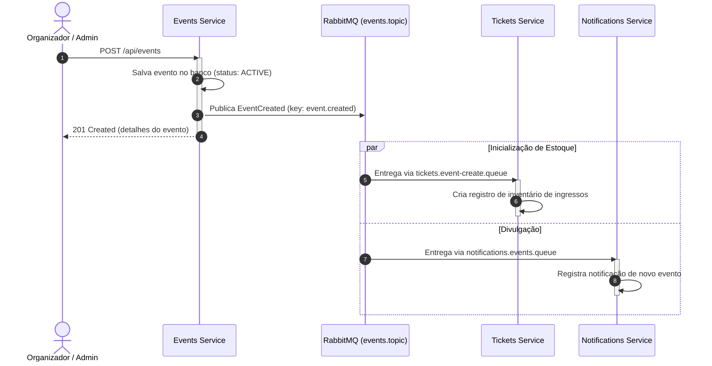
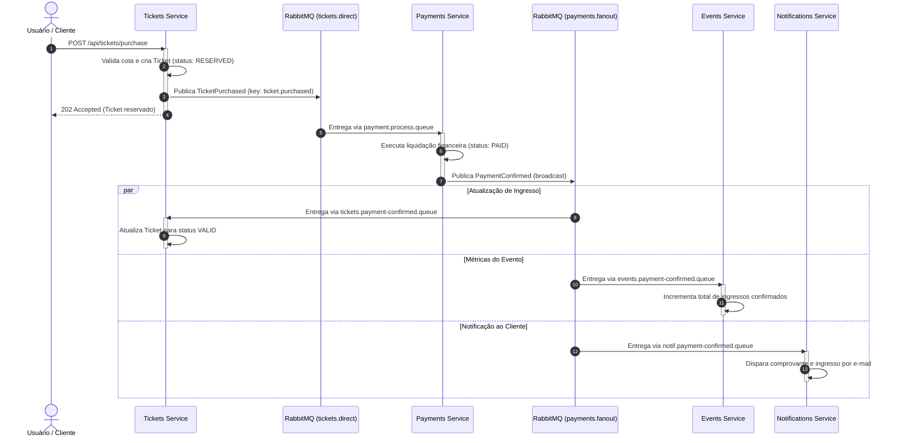
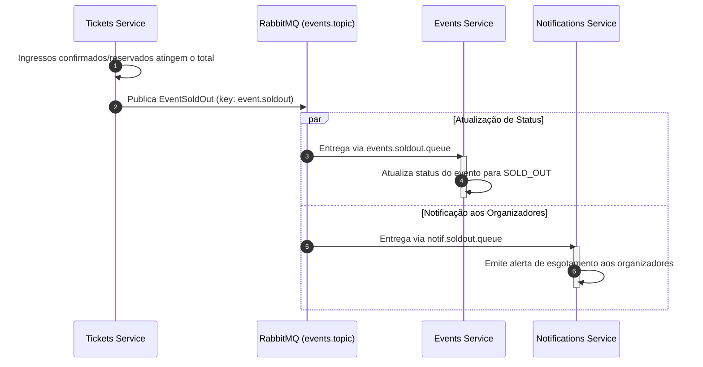
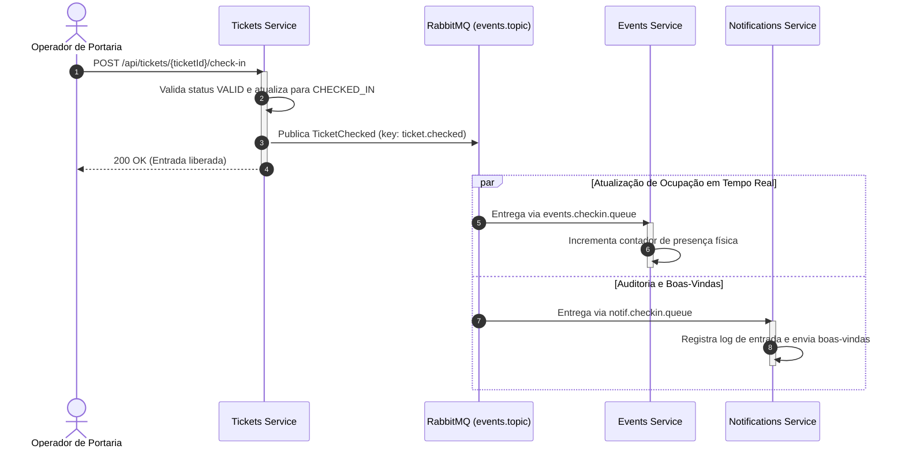

# Arquitetura e Fluxo de Eventos

## 1. Visão Geral
O sistema implementa o padrão **Event-Driven Architecture (EDA)** aliado ao princípio **Database-per-Service**. Cada microsserviço opera de forma autônoma, mantém seu próprio esquema de banco de dados relacional isolado (SQLite) e comunica-se assincronamente via **RabbitMQ**.

Essa topologia elimina dependências temporais em cascata, garante que picos de compra (flash sales) sejam enfileirados sem sobrecarregar a camada de persistência e viabiliza a inclusão de novos consumidores sem alterações nos serviços emissores.

---

## 2. Diagrama de Componentes e Topologia RabbitMQ

## 3. Serviços e Responsabilidades

### 3.1 Events Service (events)

- Porta: 8081
- Banco de Dados: SQLite (eventsdb)
- Responsabilidades:
    - Manter o catálogo de eventos (nome, data, capacidade máxima, preço base).
    - Controlar o estado de disponibilidade do evento (ACTIVE, SOLD_OUT, CANCELLED).
    - Atualizar contadores de presença física e métricas de capacidade geral.
- Mensageria:
    - Produtor: EventCreated (na exchange events.topic).
    - Consumidor: EventSoldOut, PaymentConfirmed, TicketChecked.

### 3.2 Tickets Service (tickets)

- Porta: 8082
- Banco de Dados: SQLite (ticketsdb)
- Responsabilidades:
    - Gerenciar a cota local de ingressos disponíveis por evento.
    - Processar ordens de reserva e emitir bilhetes.
    - Efetuar a validação do ingresso na portaria (check-in / validação de bilhete).
    - Detectar esgotamento de lote e disparar o alerta de lotação máxima.
- Mensageria:
    - Produtor: TicketPurchased (na exchange tickets.direct), TicketChecked e EventSoldOut (na exchange events.topic).
    - Consumidor: EventCreated (para criar o inventário local do evento) e PaymentConfirmed (para promover o bilhete de RESERVED para VALID).

### 3.3 Payments Service (payments-service)

- Porta: 8083
- Banco de Dados: SQLite (paymentsdb)
- Responsabilidades:
    - Receber intenções de compra e processar a liquidação financeira (simulação de cartão/Pix).
    - Garantir idempotência transacional por transação/ticket.
- Mensageria:
    - Consumidor: TicketPurchased (via fila dedicada ligada a tickets.direct).
    - Produtor: PaymentConfirmed (na exchange payments.fanout).

### 3.4 Notifications Service (notifications-service)

- Porta: 8084
- Banco de Dados: SQLite (notificationsdb)
- Responsabilidades:
    - Enviar alertas de confirmação de compra, ingressos gerados e alertas de evento esgotado.
    - Armazenar log de auditoria de mensagens enviadas aos clientes.
- Mensageria:
    - Consumidor: EventCreated, PaymentConfirmed, TicketChecked, EventSoldOut.
    - Produtor: Nenhum (nó terminal de consumo).

## 4. Fluxo Detalhado de Eventos

### 4.1 Cenário A: Criação de Evento

### 4.2 Cenário B: Compra e Confirmação de Pagamento

### 4.3 Cenário C: Evento Esgotado (Sold Ou

### 4.4 Cenário D: Validação na Portaria (Check-in)

## 5. Matriz de Roteamento AMQP

| Exchange | Tipo | Routing Key | Filas Vinculadas | Objetivo |
|---|---|---|---|---|
| `events.topic` | Topic | `event.created` | `tickets.event-create.queue` `notifications.events.queue` | Notificar serviços para criação de estoque local e disparos de divulgação. |
| `events.topic` | Topic | `ticket.checked` | `events.checkin.queue` `notif.checkin.queue` | Registrar entrada física no evento e auditoria de acesso. |
| `events.topic` | Topic | `event.soldout` | `events.soldout.queue` `notif.soldout.queue` | Sinalizar encerramento de novas reservas para o evento. |
| `tickets.direct` | Direct | `ticket.purchased` | `payment.process.queue` | Enfileirar pedidos de pagamento ponto a ponto diretamente para o gateway. |
| `payments.fanout` | Fanout | *(broadcast)* | `tickets.payment-confirmed.queue` `events.payment-confirmed.queue` `notif.payment-confirmed.queue` | Propagar confirmação financeira em broadcast para liberação de ingresso, métricas e comprovantes. |